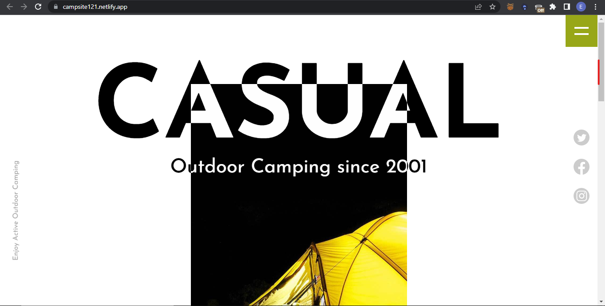

# Camping website

A responsive website using semantic HTML, Javascript and CSS grid layout to position elements on the webpage. I also explored the use of SASS preprocessor to write clean and scalable CSS code for the webpage.

## TOOLS

### Package manager

### Preprocessor

### IDE 

### Languages

## Live project

[Live Demo](https://campsite121.netlify.app)

## Screenshots

